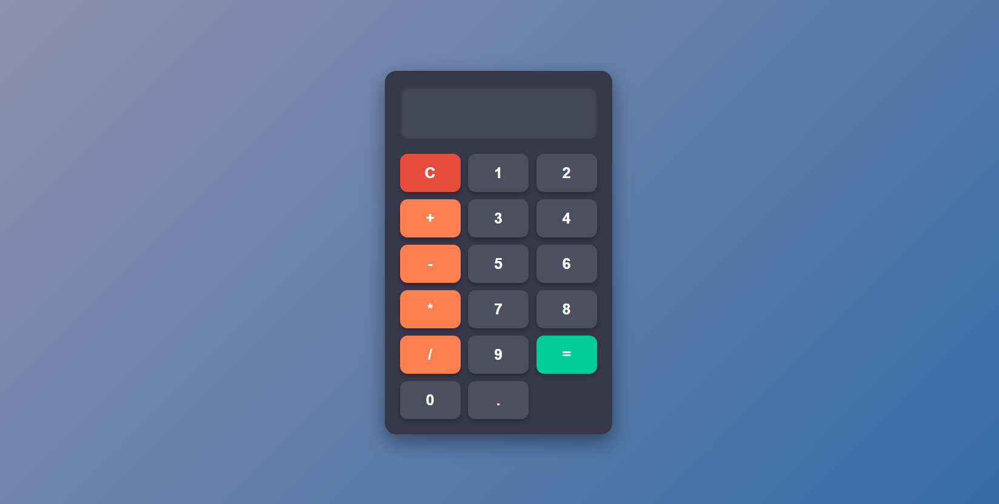

#This is my Calculator Project.

# 🔢 Dark Theme Calculator

A sleek, responsive calculator built using **HTML**, **CSS**, and **JavaScript**. This calculator features a dark modern UI, interactive button effects, and clean layout with basic arithmetic functionality.



---

## 🚀 Features

- 🌓 Modern dark theme with soft gradients and shadows
- ➕ Supports basic operations: addition, subtraction, multiplication, division
- 🧮 Keyboard and mouse support
- ✨ Hover & active animations for buttons
- 🔁 Responsive design for desktop and mobile

---

## 🛠️ Technologies Used

- HTML5
- CSS3 (Grid layout, transitions, custom styling)
- JavaScript (for logic & functionality)

---

## 📦 Installation

1. **Clone the repository**:
   ```bash
   git clone https://github.com/your-username/Calculator-project.git
   cd Calculator
